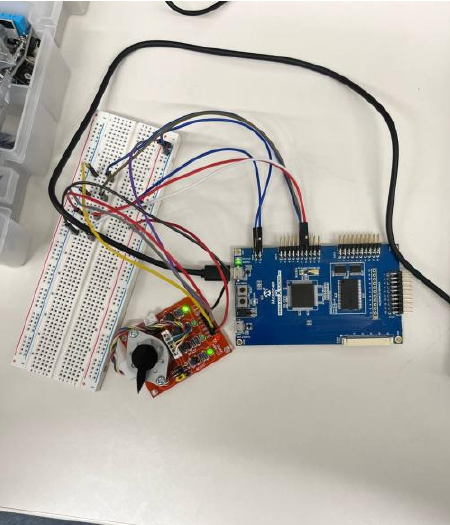
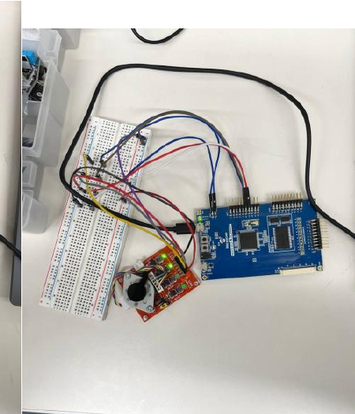
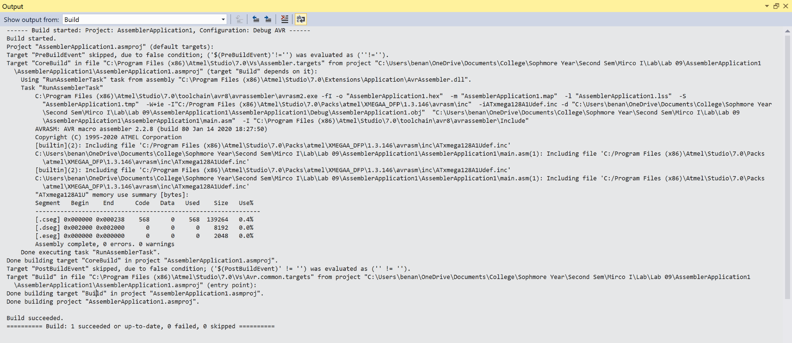

# AVR Stepper Motor Controller

A register-level **AVR Assembly** stepper motor controller built for the **ATxmega128A1U**. The program drives a stepper motor through **PORTC (PC0-PC3)**, supports **full-step and half-step operation**, rotates in both **clockwise (CW)** and **counterclockwise (CCW)** directions, and uses **Timer/Counter TCC0** to generate controlled step delays.

This repository contains the same source code that was tested on the physical hardware during the original EE 235 lab. The source was successfully assembled in Atmel Studio with 0 errors and 0 warnings.

## Overview

The controller energizes the stepper motor coils in defined binary sequences through four GPIO outputs connected to the motor driver inputs. Separate routines implement full-step and half-step motion in both directions.

The project also investigates how step timing affects real motor behavior. Three delay settings were tested:

* **10 ms** — smooth, reliable rotation
* **7.5 ms** — faster than 10 ms while remaining more stable than 5 ms
* **5 ms** — motor often failed to rotate and instead vibrated because the rotor could not mechanically keep up with the commanded step rate

This makes the project more than a basic stepping demonstration: it connects register-level firmware, timer configuration, drive sequencing, and physical motor dynamics.

## Features

* AVR Assembly implementation
* ATxmega128A1U microcontroller
* Direct register-level GPIO control
* `PC0-PC3` configured as stepper-driver outputs
* Full-step clockwise rotation
* Full-step counterclockwise rotation
* Half-step clockwise rotation
* Half-step counterclockwise rotation
* Timer/Counter `TCC0` delay generation
* 32 MHz internal system clock
* Tested 10 ms, 7.5 ms, and 5 ms step intervals
* Physical hardware verification
* Successfully assembled in Atmel Studio with 0 errors and 0 warnings

## Hardware Interface

|Signal|Microcontroller Pins|Purpose|
|-|-|-|
|Motor driver inputs `IN1-IN4`|`PC0-PC3`|Coil-drive stepping patterns|
|System clock|Internal 32 MHz RC oscillator|CPU / timer clock source|
|Timer|`TCC0`|Step-delay timing|

The motor itself is driven through an external motor-driver board rather than directly from the microcontroller GPIO pins.

## Step Sequences

### Full-Step Clockwise

```text
0011 -> 0110 -> 1100 -> 1001
```

Two coils are energized at each step, producing stronger torque.

### Full-Step Counterclockwise

```text
1001 -> 1100 -> 0110 -> 0011
```

The sequence is reversed to change direction.

### Half-Step Clockwise

```text
0001 -> 0011 -> 0010 -> 0110 ->
0100 -> 1100 -> 1000 -> 1001
```

Half-step operation alternates between one-coil and two-coil states, doubling the number of intermediate rotor positions.

### Half-Step Counterclockwise

```text
1001 -> 1000 -> 1100 -> 0100 ->
0110 -> 0010 -> 0011 -> 0001
```

## Timer-Based Step Delays

The program uses **TCC0** with the 32 MHz system clock and a `/8` timer prescaler, producing a 4 MHz timer clock.

|Requested Delay|Timer Counts|`PER` Value|
|-|-:|-:|
|10 ms|40,000|39,999|
|7.5 ms|30,000|29,999|
|5 ms|20,000|19,999|

Each step routine calls the timer delay routine after updating the PORTC output pattern.

## Experimental Results

|Step Delay|Observed Motor Behavior|
|-|-|
|**10 ms**|Smooth rotation in both full-step and half-step modes. Full-step appeared stronger.|
|**7.5 ms**|More reliable than 5 ms and faster than 10 ms; useful middle ground.|
|**5 ms**|Motor frequently failed to complete steps and vibrated instead of rotating.|

The testing showed the practical tradeoff between commanded stepping speed and available motor torque. At the shortest delay, the electrical stepping sequence advanced faster than the rotor could reliably follow.

The lab also showed that although half-step operation is theoretically smoother, it appeared less stable in this setup at faster stepping rates because the one-coil states produce less torque than the two-coil full-step states.

## Hardware Verification

The exact source in this repository was tested on the physical ATxmega128A1U stepper-motor setup.

### Hardware Setup





## Compile Verification

The original hardware-tested source was successfully assembled in Atmel Studio.

**Result: 0 errors, 0 warnings.**



## Program Structure

|Routine|Purpose|
|-|-|
|`RESET`|Initializes stack, 32 MHz clock, and PORTC|
|`FULL_CW`|Runs the full-step clockwise sequence|
|`FULL_CCW`|Runs the full-step counterclockwise sequence|
|`HALF_CW`|Runs the half-step clockwise sequence|
|`HALF_CCW`|Runs the half-step counterclockwise sequence|
|`DO_DELAY`|Selects the requested timer delay|
|`DELAY_10MS`|Generates the 10 ms TCC0 delay|
|`DELAY_5MS`|Generates the 5 ms TCC0 delay|
|`DELAY_7P5MS`|Generates the 7.5 ms TCC0 delay|

## Repository Structure

```text
AVR-Stepper-Motor-Controller/
├── README.md
├── .gitignore
├── AVR-Stepper-Motor-Controller.asmproj
├── main.asm
└── Images/
    ├── hardware_setup_1.png
    ├── hardware_setup_2.png
    └── compile_verification.png
```

## Files

* `main.asm` — original hardware-tested AVR Assembly source
* `AVR-Stepper-Motor-Controller.asmproj` — Atmel Studio assembler project
* `Images/hardware_setup_1.png` — physical hardware setup
* `Images/hardware_setup_2.png` — second hardware setup view
* `Images/compile_verification.png` — successful Atmel Studio build

## Tools

* AVR Assembly
* ATxmega128A1U
* Atmel Studio / Microchip Studio
* Timer/Counter TCC0
* Stepper motor driver hardware

## Background

This project originated in **EE 235: Microprocessor Engineering Laboratory I** at **Minnesota State University, Mankato**.

The goal was to control a stepper motor using GPIO stepping sequences and timer-generated delays, compare full-step and half-step behavior, and observe how motor performance changes as the requested step interval becomes shorter.

The source included here is the same implementation used for the hardware testing rather than a later rewritten version.

